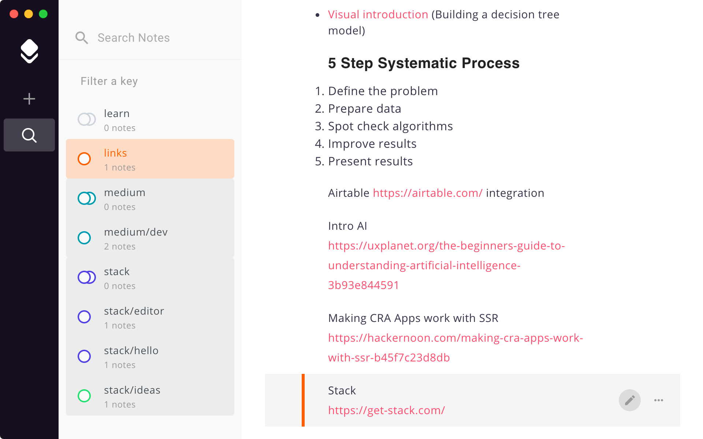

[https://get-stack.com](https://get-stack.com) | [Mac App Store](https://itunes.apple.com/us/app/stack-all-notes-in-one-place/id1299443535?ls=1&mt=12)

---

> Stack is a beautiful and flexible key-value based note editor which helps you to organize your notes, ideas, links, todos, images, videos and much more, all in one place.
**Imagine your notebook and a smart app, which helps you to be more productive, have a baby.**

Our goal is to combine the possibilities and the user-friendliness of a rich text editor with the fast writing capabilities of the Markdown syntax. And we did it!

You can use Stack as a writer, but in the first place it's made for your various (sometimes unrelated) notes, ideas, links, images, videos and much more. So to say all things which are worth saving. You can always create new notes on the top of the stack, as simple and fast as you think. If they are a bit more important just give them a key and find them easily when you need them.

The core of Stack are the keys. It's a great way to group your ideas and categorize your thoughts. You can add them to notes on the fly and compose & filter your notes later.  

## Feedback

We would love to hear your feedback on [Twitter](https://twitter.com/chryb_). If you want to support Stack, you could write a review in the [App Store](https://itunes.apple.com/us/app/stack-all-notes-in-one-place/id1299443535?ls=1&mt=12).

## Copyright

Copyright (c) 2017 Christoph Biering
